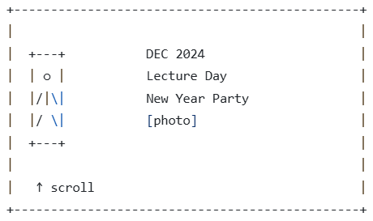

# Tomorrow School Elevator
**Tomorrow School Elevator** — это интерактивный веб-проект, в котором пользователь на лифте поднимается по хронологии первого года Tomorrow School. Каждый экран соответствует определённому месяцу и отображает ключевые события: рождение школы, первые бассейны, лекции, студ-клубы, встречи и праздники. Лифт с человечком внутри находится слева и служит проводником, а фотографии и короткие тексты справа создают ощущение живой и развивающейся среды.

Источние вдохновения
[SPAVE ELEVATOR](https://neal.fun/space-elevator/)

Финальный экран переносит зрителя в настоящее — к следующему Новому году школы, показывая, как идея превратилась в полноценное сообщество. Проект одновременно выступает как новогоднее поздравление, интерактивная хроника и витрина культуры школы, позволяя пользователю почувствовать прогресс и развитие школы через время, не отвлекаясь на сложные детали учебного процесса.

